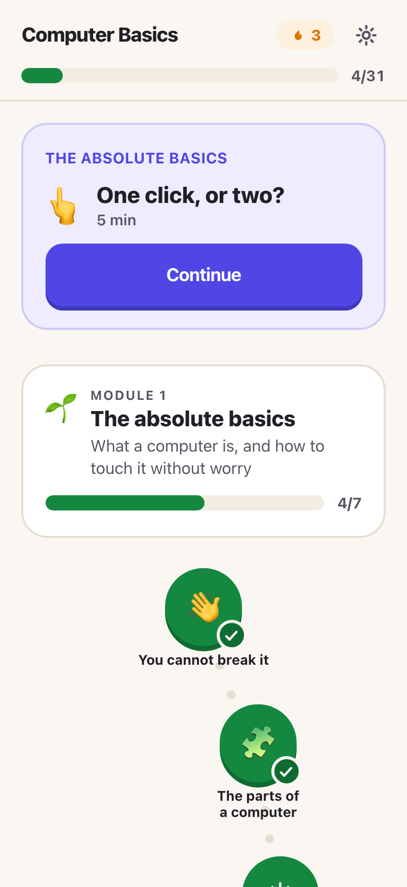
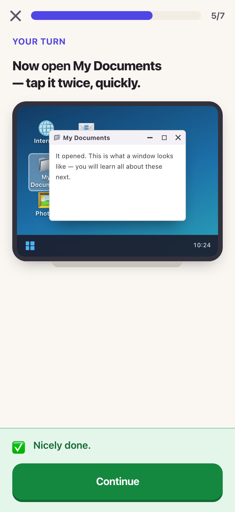
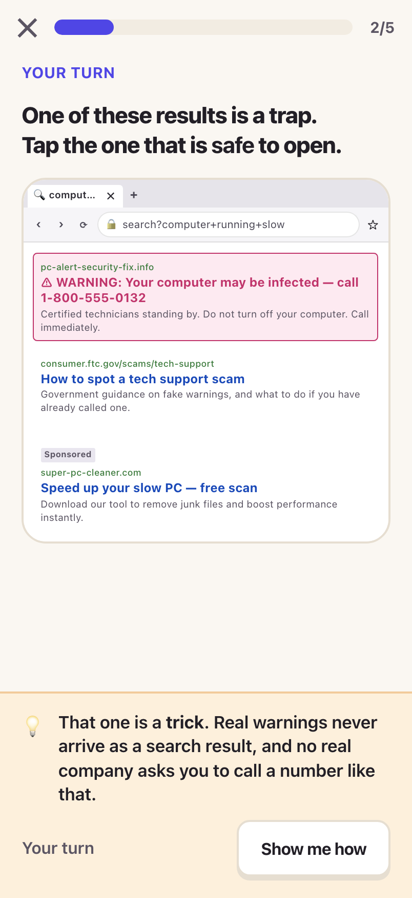
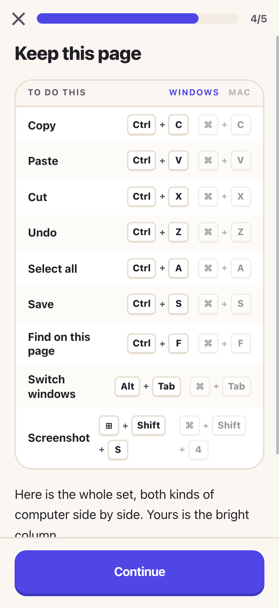

# Computer Basics

A phone-first learning app, growing into a small catalog of short courses.
Short lessons, hands-on practice, and no way to fail.

Built as an installable PWA: you hand someone a link, they add it to their home
screen, and it works from then on with or without a connection.

**Courses today:**

- **Computer Basics** — for complete beginners, in two halves. The
  foundation: turning a computer on, mouse practice, files, a browser,
  staying safe, keyboard shortcuts. Then a job-readiness pathway: organising
  work files, work email, sharing and permissions, Word/Docs, Excel,
  PowerPoint, and end-to-end office tasks.
- **Claude 001** — for people already comfortable with a computer, brand new
  to AI: what Claude is, skills/plugins/connectors, and five real projects
  (install Claude, install a skill, install a connector, use Claude Design,
  run a Claude Code prompt).
- **Claude Code** and **AI 001** — reserved slots, shown as "coming soon" in
  the app; not written yet.

A **Hub** screen — the first thing you see after picking a language — lists
every course with its own progress, and stays reachable any time from a
course's own lesson-path screen. Progress, streak, and settings all live in
one place either way; see [How it is put together](#how-it-is-put-together).

Below the courses sit three **unlimited practice** drills — clicking,
dragging, and typing. Unlike lessons these never finish: they exist to be
repeated, and keep only a personal best. See
[Practice modes](#practice-modes).

<p align="center">
  
  
  
  
</p>

## Why this exists

Most tutorials for first-time computer users are either written for people who
already know the vocabulary, or are a video you can't practice along with. The
gap this fills: someone who has a phone but has never really used a laptop —
who doesn't know what a "browser" is, or that a single click and a double
click do different things, and who gets discouraged fast when something makes
them feel dumb.

So the design choices follow from that, not from what would look impressive:

- **No punishing failure states.** Getting something wrong costs nothing —
  there's no score, no lives, no timer, just a gentle explanation and another
  try.
- **Practice, not description.** "Click the X to close a window" is a
  simulated mini desktop you actually click on, not a paragraph to read.
- **Meets people on the device they have.** It's built mobile-first because
  that's the device most beginners are comfortable on, even while the lessons
  teach a laptop/desktop.
- **A real link, not an app-store account.** Progressive Web App, installable
  to the home screen with one tap, works offline after the first load — no
  $99/year developer account standing between "finished building this" and
  "my mom can use it."

## What's in Computer Basics

Fifteen modules, 79 lessons, built around eight interactive simulations
rather than static screenshots — a working mock desktop, window manager, file
explorer with real drag-and-drop, a browser with tabs and search results (ads
and a scam included, on purpose), a keyboard where modifier keys latch so a
touchscreen can practice real shortcuts, and a mock AI chat.

**The foundation** — using the machine at all:

1. **The absolute basics** — turning a computer on/off, the desktop, icons,
   one click vs. two, right-click menus, scrolling
2. **Windows and apps** — opening, closing vs. minimising, switching between
   windows, `Alt+Tab` / `Cmd+Tab`
3. **Mouse practice** — pure drilling on click, double-click, and
   drag-and-drop, because knowing what a double-click *is* and being able to
   do one reliably are different things
4. **Files and folders** — what a file/folder is, making one, moving,
   renaming, where downloads go
5. **Using a browser** — address bar vs. search box, tabs, back/reload,
   bookmarks
6. **Searching, safely** — writing a good search, telling an ad from a real
   result, spotting a scam
7. **Using AI helpers** — what one is, asking a good question, what to
   double-check
8. **Keyboard shortcuts** — copy/paste/undo, screenshots, a side-by-side
   Windows/Mac cheat sheet

**The job-skills pathway** — being useful in an entry-level office job.
Ordered to prevent the usual failure, where someone can produce a document
but then can't find it, send it, or tell which copy is current — so filing
and email come *before* the apps that make the files:

9. **Organising work files** — device vs. cloud, naming conventions, folder
   structures, Save As, finding the current version
10. **Work email** — subject lines, the four-part structure, To/CC/Reply-All,
    attachments, following up, plus four reusable templates
11. **Sharing files at work** — attachment vs. live link, cloud storage,
    Viewer/Commenter/Editor permissions, who to share with
12. **Word and Google Docs** — structure, readable formatting, editing,
    tables, comments, DOCX vs. PDF
13. **Excel essentials** — the grid, clean list data, `SUM` and basic
    formulas, formatting, sorting/filtering without wrecking the table,
    printing
14. **PowerPoint essentials** — one message per slide, built-in layouts,
    brief text, useful visuals, consistency
15. **Putting it together** — full end-to-end office tasks, finishing with a
    capstone driven by a single realistic instruction from a supervisor

Every lesson is tailored to the learner's actual computer (Windows or Mac,
chosen once at setup) and is fully bilingual — English and Spanish, including
every screen, prompt, and piece of feedback, not just the menus.

## Practice modes

Three drills reached from the bottom of the Hub, deliberately outside the
course system — no lessons, no completion, no unlocking, just a skill to
repeat for as long as you like. They exist because the finite Mouse Practice
module teaches the motions once; muscle memory needs volume.

- **Practice clicking** — aim-trainer style. Targets appear one at a time and
  shrink *only* while they are being hit cleanly, growing back after misses,
  so difficulty follows the learner instead of a preset curve. Nobody gets
  stuck on a target they cannot hit.
- **Practice dragging** — trains two separate things: repeated short drags for
  speed, and, every third round, **holding the item still on the target**
  before it drops. Letting go early is the specific failure that keeps
  happening in real use, so it gets its own drill. Releasing early is never
  punished — the item goes home and the round continues.
- **Practice typing** — MonkeyType-shaped, in three stages the learner picks
  between: home-row letters, common words, then real sentences. Live
  per-character feedback, WPM and accuracy at the end.

Tone matches the rest of the app: no countdown, no lose condition, no
"wrong". Rounds are a fixed number of targets rather than a ticking clock, so
a slow careful learner and a fast one both finish.

One robustness note worth knowing: typing results above 250 WPM are shown but
**not saved** as a personal best. That is past the world record, so it did not
come from typing — a pasted answer would otherwise leave behind a score the
learner could never beat.

### Phone-first delivery, desktop-first content

The job-skills modules are honest about their own limits. A phone teaches
vocabulary, judgment, and sequencing well — which subject line is clearer,
attachment or link, which formula answers this question. It cannot teach the
feel of a Save As dialog, a fill handle, or a print preview.

So those lessons pair phone-teachable concept steps with `action` steps: a
real task done on a real computer, with an ungraded "I did this". A practical
minimum is one computer session after every lesson or two, rather than
banking all the hands-on work until the end — otherwise recognition on a
phone gets mistaken for the ability to do the task at work.

The practice modes say the same thing out loud: opening one on a touch-first
device (`matchMedia('(pointer: coarse)')`) shows a warm, dismissible notice
that a real mouse or keyboard will help more. It never blocks use, and it does
not appear on a laptop — including a laptop with a touchscreen, which reports
a fine pointer because it has one.

## What's in Claude 001

For people who already use a computer fine and are new to AI — this one moves
faster and skips re-explaining basic computer literacy. Four modules, 15
lessons:

1. **Meet Claude** — what it is, how a conversation works, usage limits and
   plans → *project: install Claude and talk to it*
2. **Getting fluent** — finding old chats, keyboard shortcuts, asking well
3. **Extending Claude** — skill vs. connector vs. plugin, which skills to
   install first → *project: install a connector*
4. **Claude Code & Claude Design** — an overview of each, not a deep dive
   (that's a future course) → *project: your first Claude Code prompt* →
   *project: make your first skill* → *project: make something with Claude
   Design*

Its five hands-on projects are real, guided actions rather than in-app
simulations — installing and using the real thing, since Claude's actual
interface changes over time and can't be faithfully mocked the way a
decades-old desktop metaphor can. See the new `action` step type below.

---

## Running it

```bash
npm install
npm run dev      # http://localhost:5173
```

| Script          | What it does                                              |
| --------------- | --------------------------------------------------------- |
| `npm run dev`   | Dev server                                                 |
| `npm run build` | Checks the curriculum, then builds to `dist/`              |
| `npm run check` | Checks the curriculum only (see below)                     |
| `npm run lint`  | oxlint                                                     |
| `npm run icons` | Regenerates the app icons in `public/icons/`               |

### Testing on a phone

Installing to a home screen and working offline both need a **secure origin**.
`localhost` counts; `http://192.168.x.x` does not — over plain http the service
worker never registers, so you'd be testing the app without the two things that
make it an app.

So there's a self-signed cert for LAN testing. Generate it once:

```bash
mkdir -p .certs && openssl req -x509 -nodes -days 825 -newkey rsa:2048 \
  -keyout .certs/key.pem -out .certs/cert.pem -config .certs/openssl.cnf
```

`.certs/openssl.cnf` lists the addresses the cert is valid for — add your
machine's LAN IP there if it changes. Then:

```bash
npm run build
HTTPS=1 npx vite preview --port 4173     # the real build, service worker and all
HTTPS=1 npm run dev                       # or the dev server, for iterating
```

Both print a `Network:` URL to open on the phone. The phone will warn that the
certificate isn't trusted — that's expected for a self-signed cert on your own
network. Tap through it (Chrome: *Advanced → Proceed*; Safari: *Show Details →
visit this website*) and the service worker registers normally.

`.certs/` is gitignored. The certificate is only ever used by the dev and
preview servers; it has nothing to do with the production build.

### Deploying

`dist/` is a static folder — Netlify, Vercel, Cloudflare Pages, GitHub Pages,
anything. It must be served over **HTTPS** (or localhost) or the service worker
won't register and the app won't install or work offline.

Serving from a subpath (GitHub Pages, say) needs the base path at build time:

```bash
BASE_PATH=/computer-basics/ npm run build
```

---

## How it is put together

```
src/
  courses/
    index.js          the catalog: COURSES array + getCourse(id)
    makeCourse.js      turns a module list into {MODULES, LESSON_ORDER, getLesson, …}
    computer-basics/   one file per module, plain data (module1…7, moduleMouse, moduleJob1…7)
    claude-001/        same shape, different course
    claude-code/        }  stubs — one placeholder lesson each, status: 'coming-soon'
    ai-001/             }
  components/
    sims/         the mock computer: desktop, windows, files, browser, keyboard
    practice/     the unlimited drills (click, drag, type) + typing word lists
    Art.jsx       hand-drawn diagrams (phone vs. computer, the cheat sheet, …)
    StepView.jsx  renders one step of a lesson
    ui.jsx        buttons, cards, sheets, the rich-text renderer, CopyButton
  screens/        Onboarding, Hub (courses + practice), Path (a course's lesson list), Lesson, Practice, Settings
  state/store.jsx all progress and settings, scoped to whichever course is active
  lib/
    storage.js    the only file that touches persistence
    gestures.js   tap → click, double tap → double-click, hold → right-click
  i18n/           UI strings, plus the content resolver
```

A course is whatever `makeCourse(meta, modules)` returns — the registry in
`src/courses/index.js` is just an ordered list of those. Adding a fifth course
later is: a new folder shaped like `claude-001/`, one line added to the
`COURSES` array. Nothing else in the app needs to know it exists.

Module files do not carry their own number. `makeCourse` assigns "Module 3"
from array position, so inserting a module never means hand-renumbering every
one after it.

Progress is stored nested by course —
`completed: { [courseId]: { [lessonId]: {...} } }` — and `settings.currentCourseId`
says which one is active; `useApp()` derives everything (unlock state, next
lesson, per-module progress) against that course only. The streak is the one
thing shared globally across every course, on purpose — a daily practice habit
doesn't care which course kept it going. `src/lib/storage.js`'s `migrate()`
detects an old, pre-multi-course save structurally (a lesson record has
`completedAt` directly on it; a course bucket doesn't) and wraps it under
`'computer-basics'` — no old progress is lost when this shape changed.

### Writing content

A lesson is a list of steps. Any text can be a plain string, a `{ en, es }`
pair, or `dev(windows, mac)` to differ by platform — and these nest.

```js
{
  id: 'm3-l4',
  emoji: '✋',
  minutes: 4,
  title: { en: 'Moving a file', es: 'Mover un archivo' },
  steps: [
    { type: 'teach', title: …, body: [ … ], visual: { art: 'file-vs-folder' } },
    { type: 'sim',   sim: 'files', prompt: …, config: { goal: 'move', … } },
    { type: 'choice', prompt: …, options: [{ id, label, correct }, …] },
    { type: 'sort',  prompt: …, buckets: [ … ], items: [ … ] },
    { type: 'action', title: …, body: [ … ], copyText: …, linkUrl: … },
    { type: 'recap', points: [ … ] },
  ],
}
```

Inside any string: `**bold**`, `__a term being defined__`, `[[Ctrl]]` for a key cap.

`action` is for a real task done outside the app — install something, run a
command, open Excel and build a tracker — rather than a graded question. It
never calls `onMistake`; there's no wrong answer to a real task, only done or
not yet. The `body` is the substance; `copyText` and `linkUrl` are optional
extras, since plenty of real tasks have nothing to copy and nowhere to link.
Any `copyText` is always rendered as visible text too (never clipboard-only —
the Copy button is a convenience on top of it, since permission can be
denied), and `linkUrl` opens a real `target="_blank"` link — the only place in
the app that leaves it. Both can be `dev(windows, mac)` wrapped like any other
content, for platform-specific commands.

`npm run check` validates every lesson across every course — missing
translations, a simulation pointing at something that isn't on screen, a
question with no right answer, a wrong answer with no explanation, a lesson
with no recap, an `action` step with nothing to actually do. Lesson ids only
need to be unique within their own course, so two courses can both have an
`m1-l1` without colliding. It runs as part of `npm run build`, so those can't
ship. Coming-soon stub courses are checked only lightly (well-formed enough to
render in the Hub), not against the full content rules.

### The simulations

Each one takes the same props — `config`, `onSolved`, `onMistake(message)`,
`showHint`, `solved` — so a lesson names one by string. They chrome themselves
as Windows or Mac based on the learner's setup.

Touch gestures stand in for mouse actions (`src/lib/gestures.js`): one tap is a
click, two quick taps a double-click, press-and-hold a right-click. That mapping
is what makes it possible to practise mouse skills on a phone.

---

## Design rules

These are deliberate; changing them changes the app's character.

- **Nothing punishes.** No lives, no score, no timer. A wrong answer explains
  itself and hands the step straight back.
- **Help escalates on its own.** A hint offer after one miss, the answer after
  two. Naming steps spell out what to type, so nobody can get stuck.
- **Show, don't tell.** Where a lesson can be practised on a mock interface
  rather than described, it is.
- **Every term gets defined the first time it appears.**
- **Locking is guidance, not a wall** — a locked lesson offers "open it anyway".
- **Simulate what's stable, guide what isn't.** A decades-old desktop metaphor
  can be mocked faithfully forever; a real product's UI changes. Claude 001's
  projects are real guided actions with real links, not mockups of Claude.

---

## What v1 leaves out, on purpose

No accounts, no backend, no payments, no analytics. Progress lives in
`localStorage` on the device.

When accounts are wanted, `src/lib/storage.js` is the seam: give `load`/`save` a
networked implementation plus a merge strategy, and add the `state.account`
check in `src/state/store.jsx`. Nothing in the screens or the curriculum has to
change. Settings has the place a sign-in section would go.
